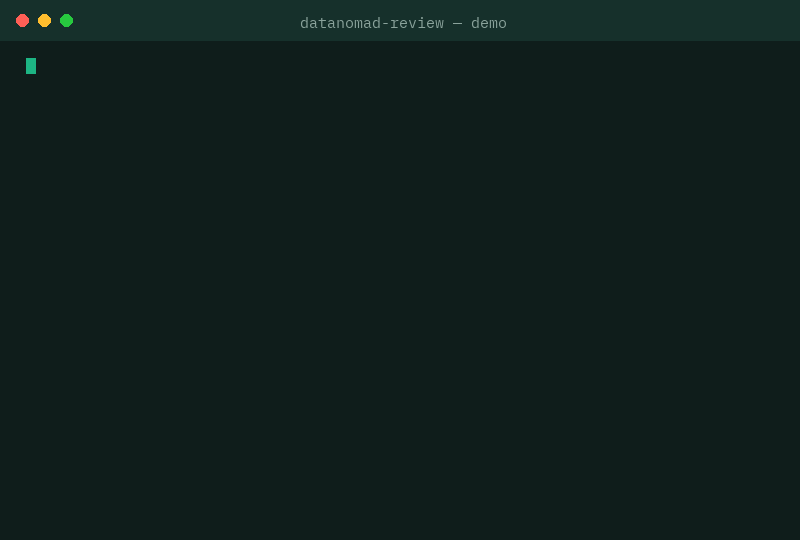

# datanomad-review

[](https://pypi.org/project/datanomad-review/)
[](https://github.com/datanomadlab/datanomad-review)
[](LICENSE)

> **Open framework + toolkit to review data platforms and cloud spend on GCP & AWS.**
> Methodology, scorecard, anti-pattern catalog, runbooks, safety patterns, and read-only scanners.
> Built and maintained by [DatanomadLab](https://www.datanomadlab.com) · MIT licensed.



`datanomad-review` es un "Well-Architected para plataformas de datos": evalúa una plataforma en **7 dimensiones** — Arquitectura, Gobierno, Calidad, Costo (FinOps), Escalabilidad, Seguridad y **AI-Readiness** — y produce un **scorecard** con un **roadmap priorizado**.

Típico resultado en plataformas no gobernadas: **20–40% de ahorro en costo de datos** + una ruta clara para dejar los datos listos para IA.

---

## Tabla de contenidos

- [Por qué existe esto](#por-qué-existe-esto)
- [Quick start](#quick-start)
- [Herramientas](#herramientas)
- [Cómo funciona](#cómo-funciona)
- [Las 7 dimensiones](#las-7-dimensiones)
- [Metodología F.L.O.W.](#metodología-flow)
- [Safety patterns](#safety-patterns)
- [Catálogo de anti-patrones](#catálogo-de-anti-patrones)
- [Runbooks](#runbooks)
- [Roadmap del proyecto](#roadmap-del-proyecto)
- [¿Quieres que aplique esto a tu plataforma?](#quieres-que-aplique-esto-a-tu-plataforma)

---

## Por qué existe esto

La mayoría de los equipos de datos vive alguna combinación de:

- Proyectos de IA trabados porque *"los datos no están listos"*.
- Un data lake convertido en pantano: nadie confía del todo en los números.
- Facturas de BigQuery / Redshift / almacenamiento creciendo más rápido que los ingresos.
- Pipelines duplicados, sin dueño, sin lineage y sin gobierno.

Los frameworks de cloud (Well-Architected) revisan infraestructura, pero **no revisan la plataforma de datos como sistema**: modelado, gobierno, calidad, costo por query, y si los datos sirven o no para IA. Este framework llena ese vacío — y es abierto, para que cualquier equipo pueda auto-evaluarse.

## Quick start

```bash
pip install datanomad-review

# Demo autocontenida: escanea un proyecto de ejemplo incluido (sin credenciales, sin red)
datanomad-review demo

# Revisión estática de un proyecto dbt (sin credenciales)
datanomad-review scan dbt ./mi-proyecto-dbt

# Linter de costo para BigQuery (usa tus propias credenciales, read-only)
pip install "datanomad-review[gcp]"
datanomad-review scan bigquery --project mi-proyecto-gcp

# Escaneo read-only de costos AWS (Cost Explorer)
pip install "datanomad-review[aws]"
datanomad-review scan aws-cost --profile mi-perfil

# Autoevaluación guiada (sin credenciales): genera scorecard desde los checklists
datanomad-review assess --interactive

# ¿Por qué subió la cuenta este mes? Dos exports CSV de facturación, cero credenciales
datanomad-review billing-diff enero.csv febrero.csv

# Teardown anonimizado listo para publicar (montos redondeados, proyectos ocultos)
datanomad-review teardown enero.csv febrero.csv --sector retail -o teardown.md

# ¿Cuánto costará esta query? Dry-run de BigQuery, no ejecuta nada
pip install "datanomad-review[gcp]"
datanomad-review query-cost models/ --project mi-proyecto-gcp --fail-over-usd 25
```

Toda ejecución es **read-only**. Ver [Safety patterns](docs/safety-patterns.md) y los [permisos mínimos por scanner](docs/permissions.md) (roles GCP / política IAM AWS).

## Herramientas

| Comando | Qué hace | Credenciales |
|---|---|---|
| `demo` | Demo autocontenida sobre un proyecto de ejemplo | Ninguna |
| `scan dbt <path>` | Revisión estática de un proyecto dbt | Ninguna |
| `scan bigquery` | Costo y arquitectura BigQuery (metadata + jobs) | GCP read-only |
| `scan aws-cost` | Spikes, gasto sin tag y top servicios (Cost Explorer) | AWS read-only |
| `assess --interactive` | Autoevaluación guiada → scorecard | Ninguna |
| `billing-diff <antes> <después>` | Explica en lenguaje humano por qué cambió la cuenta: qué servicios, qué proyectos, % del delta | Ninguna (CSV local) |
| `teardown <antes> [<después>]` | Genera un teardown anonimizado en markdown, listo para LinkedIn/newsletter | Ninguna (CSV local) |
| `query-cost <paths...>` | Estima el costo de queries `.sql` vía dry-run y bloquea el desperdicio en CI | GCP (`bigquery.jobs.create`) |

`billing-diff` y `query-cost` también se instalan como comandos standalone: `datanomad-billing-diff` y `datanomad-query-cost`. Formatos CSV soportados (GCP Cost table, AWS CUR, Cost Explorer, genérico): [`docs/billing-formats.md`](docs/billing-formats.md).

### query-cost en CI (GitHub Action)

La marca de tu equipo de datos en cada PR: comenta el costo estimado de cada query y falla el job si supera el umbral.

```yaml
# .github/workflows/query-cost.yml
on: pull_request
permissions:
  contents: read
  pull-requests: write
  id-token: write
jobs:
  query-cost:
    runs-on: ubuntu-latest
    steps:
      - uses: actions/checkout@v4
      - uses: google-github-actions/auth@v2
        with:
          workload_identity_provider: ${{ secrets.GCP_WIF_PROVIDER }}
          service_account: ${{ secrets.GCP_SA_EMAIL }}
      - uses: datanomadlab/datanomad-review@v0.3.0
        with:
          paths: models/
          project: mi-proyecto-gcp
          fail-over-usd: "25"
```

O como hook de [pre-commit](https://pre-commit.com):

```yaml
repos:
  - repo: https://github.com/datanomadlab/datanomad-review
    rev: v0.3.0
    hooks:
      - id: datanomad-query-cost
        args: ["--project", "mi-proyecto-gcp", "--fail-over-usd", "25"]
```

### Así se ve

Salida real del scanner dbt sobre [`examples/sample-dbt-project`](examples/sample-dbt-project):

```text
═══ DATANOMAD REVIEW · SCORECARD ═══

─── Hallazgos (4) ───

  🟠 [AP-G02] Solo 25% de los modelos tiene tests (3/4 sin tests)
       evidencia: ej: fct_orders, stg_customers, stg_orders
       fix: Política de PR: ningún modelo sin tests mínimos (unique/not_null).
  🟡 [AP-G02b] 3/4 modelos sin descripción
       evidencia: ej: fct_orders, stg_customers, stg_orders
       fix: Documentar modelos críticos primero (los que alimentan dashboards/IA).
  🟡 [AP-AI01] Solo 0/2 sources con freshness configurado
       fix: Definir freshness SLAs; alimenta la fase WATCH.
  🟡 [AP-C02] 1 modelos (fuera de staging) usan SELECT *
       evidencia: ej: fct_orders
       fix: Proyección explícita de columnas en capas curated/marts.

⚠  1 hallazgo de severidad alta. Prioriza con la matriz impacto×esfuerzo (fase LOCK).
```

## Cómo funciona

```
┌─────────────┐     ┌──────────────┐     ┌───────────────┐
│  Checklists  │     │   Scanners    │     │   Scorecard    │
│  (rúbricas   │ ──▶ │  (read-only:  │ ──▶ │  + hallazgos   │
│   YAML/MD)   │     │  BQ/AWS/dbt)  │     │  + roadmap     │
└─────────────┘     └──────────────┘     └───────────────┘
```

1. **Checklists** — rúbricas por dimensión en `framework/checklists/`, puntuables a mano o vía CLI.
2. **Scanners** — chequeos automatizados read-only en `src/datanomad_review/checks/` que detectan anti-patrones concretos (tablas sin particionar, `SELECT *` caros, recursos zombie, modelos dbt sin tests…).
3. **Scorecard** — consolida todo en un puntaje 0–100 por dimensión + hallazgos priorizados por impacto/esfuerzo.

## Las 7 dimensiones

| # | Dimensión | Pregunta que responde |
|---|-----------|----------------------|
| 1 | **Arquitectura** | ¿El diseño de la plataforma es coherente, modular y mantenible? |
| 2 | **Gobierno** | ¿Hay dueños, contratos de datos, catálogo y lineage? |
| 3 | **Calidad** | ¿Se puede confiar en los números? ¿Hay tests y monitoreo? |
| 4 | **Costo (FinOps)** | ¿Cuánto se desperdicia y quién es dueño de la factura? |
| 5 | **Escalabilidad** | ¿La plataforma aguanta 10x sin reescritura? |
| 6 | **Seguridad** | ¿PII gobernada, accesos mínimos, auditoría? |
| 7 | **AI-Readiness** | ¿Los datos sirven hoy para entrenar/alimentar IA con confianza? |

Rúbricas completas: [`src/datanomad_review/framework/scorecard.yaml`](src/datanomad_review/framework/scorecard.yaml) · Checklists por dimensión: [`framework/checklists/`](framework/checklists/)

## Metodología F.L.O.W.

El framework se aplica en 4 fases: **Find → Lock → Optimize → Watch**.
Documento completo: [`docs/methodology-flow.md`](docs/methodology-flow.md)

## Safety patterns

Reglas no negociables para revisar entornos ajenos (o el propio) sin romper nada: read-only por defecto, nunca borrar automático, evidencia antes de recomendación, cambios solo vía runbook y en dev primero. Detalle: [`docs/safety-patterns.md`](docs/safety-patterns.md)

## Catálogo de anti-patrones

Los modos de falla más comunes (y caros) en plataformas de datos, con síntoma → impacto → detección → fix: [`docs/anti-patterns-catalog.md`](docs/anti-patterns-catalog.md)

## Runbooks

Guías paso a paso para ejecutar los fixes sin downtime: [`docs/runbooks/`](docs/runbooks/)

## Roadmap del proyecto

- [x] Framework de checklists + scorecard (YAML)
- [x] CLI con scanners read-only: dbt, BigQuery, AWS Cost Explorer
- [x] `billing-diff`: explica el cambio de la cuenta desde dos exports CSV (GCP/AWS)
- [x] `teardown`: teardown anonimizado en markdown desde exports de facturación
- [x] `query-cost`: dry-run de queries BigQuery + GitHub Action + hook de pre-commit
- [x] Sistema de plugins (entry points) para quantifiers, renderers y plantillas
- [ ] Reporte HTML del scorecard (disponible vía plugins)
- [ ] `zombie-hunter`: recursos sin uso (discos, IPs, clusters) con ahorro estimado
- [ ] AI-readiness score como web estática compartible
- [ ] Scanner GCP Billing / BigQuery INFORMATION_SCHEMA profundo
- [ ] Scanner Redshift / Databricks
- [ ] Agente (Claude Code subagent) que ejecuta la revisión end-to-end
- [ ] Integración con [aws-cost-optimization-agent](https://github.com/sercasti/aws-cost-optimization-agent) para la dimensión de costo AWS

Contribuciones bienvenidas — abre un issue o PR.

## ¿Quieres que aplique esto a tu plataforma?

Este framework es libre y puedes correrlo tú mismo: la CLI detecta el **primer nivel de hallazgos** con tus propios datos. La cuantificación fina del desperdicio en USD, la interpretación contra benchmarks y el roadmap de remediación priorizado son el **Data Platform Health Check** de [DatanomadLab](https://www.datanomadlab.com): 3 semanas, precio fijo, 100% read-only, y garantía 3× (si no identifico valor de al menos 3 veces el fee, devuelvo el 100%). El roadmap alimenta las dos consultorías de DatanomadLab: **FinOps** (administración y optimización de gastos de nube) y **Data Engineering** (arquitectura y operaciones de datos).

📩 **[Agenda un diagnóstico inicial de 30 min, sin costo →](https://www.datanomadlab.com/#contacto)**

---

MIT © DatanomadLab / Felipe Veloso
